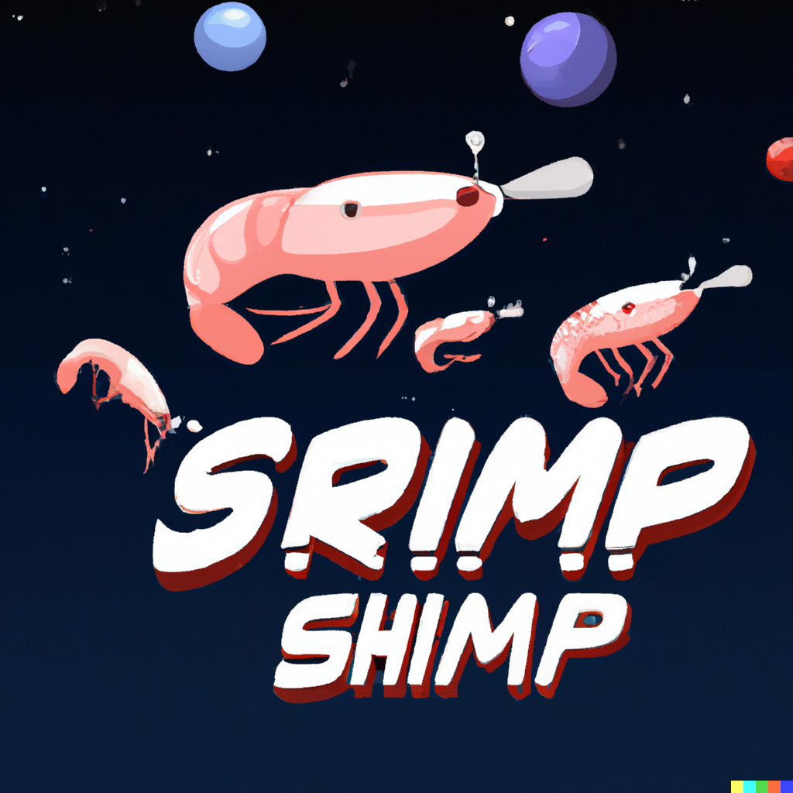
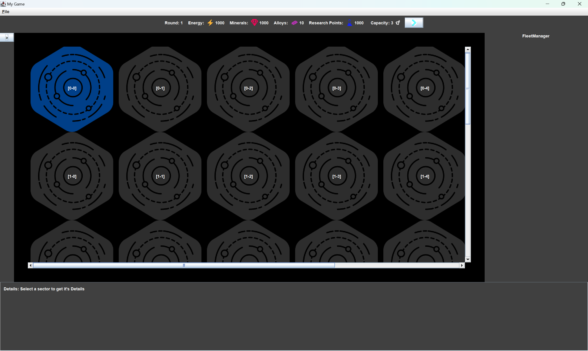
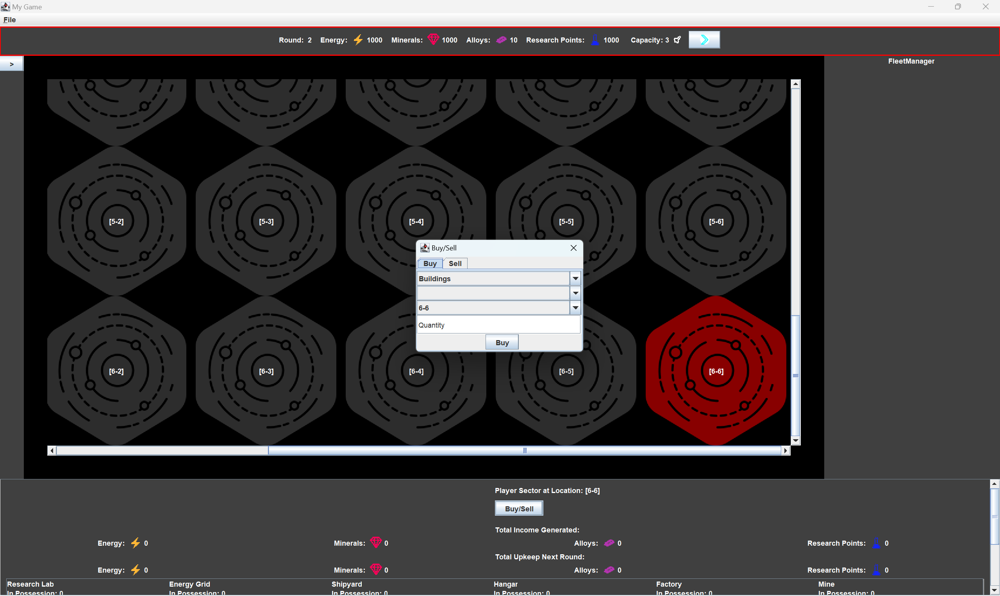

## A Project for SE at HTWG Konstanz in SS23

## Srimp Shimp

This is a 2-player turn-based strategy game set in space. It was developed during the summer semester of 2023 for a Software Engineering course. The game revolves around managing sectors in a game map, making strategic decisions around resource management, and constructing buildings or recruiting units.

## Core Features:
**Multiplayer:** The game supports two players, each with their own sectors and resources.

**Sector Control:** Players manage various sectors. Each sector supports the construction of buildings to grant you the resources to size up your fleets and crush the enemy.

**Resource Management:** There are several resources to manage in the game:

- Energy: Essential for maintaining units and buildings.
- Minerals: Used for constructing units and buildings.
- Alloys: A higher-level resource used in advanced constructions.
- Research Points: Necessary for researching new technologies.

Building Construction: Players can construct several types of buildings:

- Energy Grid: Generates Energy.
- Mine: Produces Minerals.
- Factory: Produces Alloys.
- Hangar: Increases the capacity for units in a sector.
- Research Lab: Generates Research Points.
- Shipyard: Allows for unit construction within a sector.

**Unit Recruitment and Management:** Units can be recruited and managed across the player's sectors. A queuing system for building and recruitment provides a layer of strategic planning.

**Technology Research:** Players can allocate Research Points to discover new technologies, currently the following technologies are included:

- Advanced Materials
- Polymer
- Advanced Propulsion
- Nano Robotics

Please note that this game is in development, and certain features might change. Currently, the effects of the researched technologies are not implemented into the game. 

##### Some Impressions:

